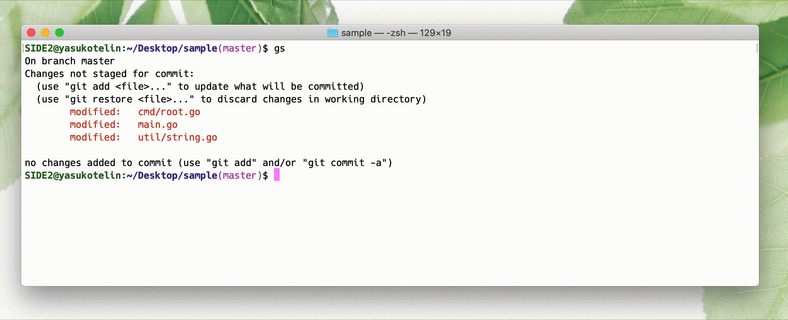
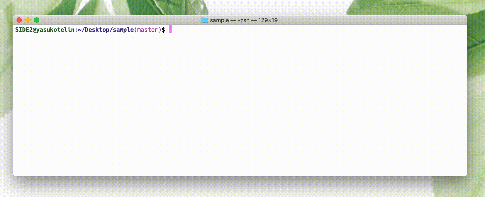

# git-ex

[Japanese page](./README-JP.md)

git-ex is a subcommand that extends Git.

## Installation

```
go get -u github.com/yasukotelin/git-ex
```

## Commands

- `git ex stage`
- `git ex unstage`
- `git ex discard`

## Features

### Stage

```
git ex stage
```

You can stage the files with selecter.



### UnStage

```
git ex unstage
```

You can unstage the files with selecter.



### Discard

```
git ex discard
```

This executes the removing all changes from the HEAD that include untracked files.

`git checkout .` doesn't remove untracked files.

## Author

yasukotelin

## LICENCE

MIT LICENCE